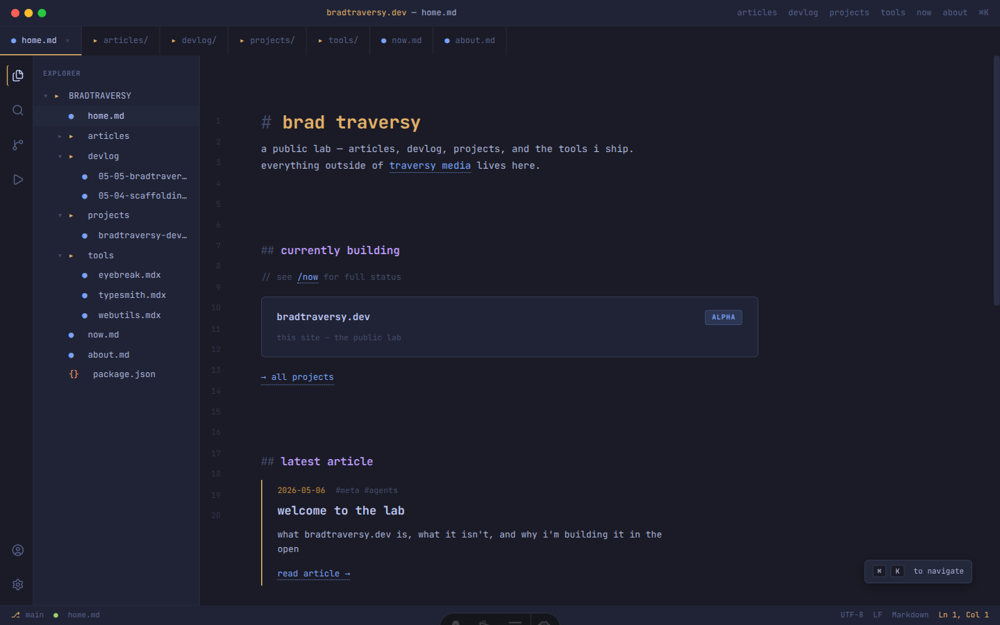

# bradtraversy.dev

my public lab — projects, tools, devlog, and articles. built for anyone who wants to follow my daily work, side projects, and what i'm shipping outside of [traversy media](https://traversymedia.com).



## what this is

a static site that combines four things on different cadences:

- **projects** — software i'm working on, with their own detail pages
- **tools** — one-day utilities, scaling to a 50+ catalog over time
- **devlog** — short, raw, posted whenever something ships or breaks
- **articles** — polished, long-form, 1–4 a month

it's the public surface for the work i do outside of [traversy media](https://traversymedia.com) — distinct from the joint youtube/courses brand, branded under my personal name.

## stack

- [astro 6](https://astro.build) + [mdx](https://mdxjs.com) for content
- [tailwind v4](https://tailwindcss.com) for styling
- [vercel](https://vercel.com) for hosting + a single serverless route (`/api/subscribe`)
- [buttondown](https://buttondown.com) for the newsletter
- self-hosted [jetbrains mono](https://www.jetbrains.com/lp/mono/) (woff2 subset)

static-first. every page is pre-rendered at build time. there's roughly zero client JS on text pages and a tiny handler on a few interactive surfaces (the subscribe form, the hero-image modal).

## local development

requires node 22+ and pnpm.

```sh
pnpm install
pnpm dev      # localhost:4321
pnpm build    # production build → ./dist
pnpm preview  # serve the production build locally
```

newsletter signup needs a buttondown api key in `.env`:

```
BUTTONDOWN_API_KEY=...
```

without it, the form returns `500` but everything else works.

## structure

```
src/
  content/
    projects/    # MDX, one per major project
    tools/       # MDX, one per one-day utility
    devlog/      # MDX, slug = YYYY-MM-DD-kebab-title
    articles/    # MDX, slug = filename
  components/    # astro components
  layouts/       # base + per-content-type layouts
  pages/         # routes
  styles/        # global css only

docs/
  specs/         # PRD, IA, tech stack, content + monetization plan
  visual-north-star/  # the home-page mockup the design is anchored to
```

content has zod-validated frontmatter — see [`src/content.config.ts`](src/content.config.ts).

## contributing

this is a personal site. typo fixes and broken-link reports via issues are welcome; substantive PRs probably aren't a fit.

## license

all rights reserved. this repo is public for transparency and reading — not for reuse. you can read the code and reference patterns, but please don't copy, fork, or republish it to build your own site or product. if there's something here you'd like to use, [reach out](mailto:traversymedia@gmail.com) — most reasonable asks get a yes. see [`LICENSE`](LICENSE) for the long version.
