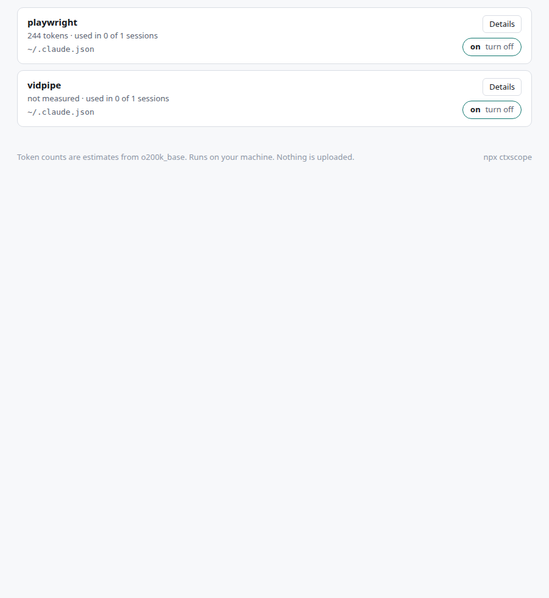

I have been building ctxscope, a local tool for inspecting the context that
Claude Code and Codex load around a project. The repo is private and there is
no public package release yet.

*Development UI inspecting this site. Token counts are estimates for this setup.*

Instruction files, skill listings, and MCP tool definitions can add up before
I even ask an agent to do anything. I wanted a way to see where that overhead
comes from instead of guessing which part of my setup to trim.

The local web UI breaks it down with a treemap and a map of the files and
servers involved. The new home page separates the shared "Everywhere"
baseline from individual projects, so I can see what follows me into every
repo and what belongs to one project.

Findings can now become fix prompts. Each prompt includes the problem, the
file and line, and a suggested change. I can copy it or hand it to my coding
agent, then review the resulting diff. There are also controls for opening
the relevant file and reviewing MCP configuration changes.

The latest cleanup makes every project card show its numbers and adds a
loading state while the projects are being collected. Small details, but
they make comparing projects much easier.

This is an inspection tool, not a live meter of everything a model thinks
about during a conversation. The useful question is simpler: what am I
loading, where did it come from, and does it need to be there?
