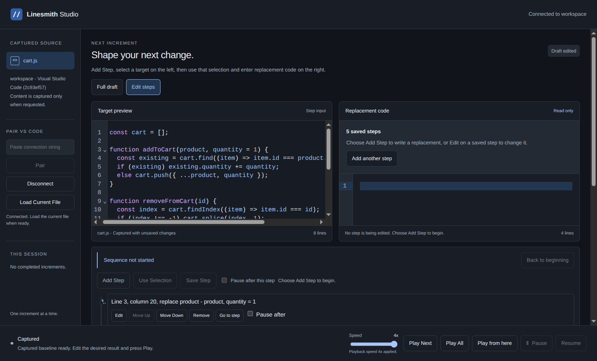

Linesmith Studio is a private project I am building. It is still in development
and is not available to download yet.

*Development build showing a sample shopping-cart edit sequence.*

The idea is to control how code appears in VS Code, one increment at a time.
Start with the current file, write the result you want, and play the changes
into the editor. You do not need a finished project or a script for the whole
session before you start.

The desktop app now connects to the VS Code bridge, captures the active file,
and controls playback. Both code panes have proper editors, and playback speed
can change while a take is running. Pause, resume, and restart are part of the
same flow.

The latest addition is explicit edit steps. Instead of supplying only the
finished code, I can choose a location or selection, define that edit, then
add the next step against its result. A step can include a pause when I need
time to explain something. That gives me control over the order of the edits,
not just the final result.

I have also been careful about what happens when the editor changes underneath
the app. A disconnect stops scheduled edits, and reconnecting means capturing
the actual file again. I do not want playback guessing what code is there.

There is more to do before a release, including signed installers and native
macOS and Windows verification. For now, the connected editing workflow is
coming together.
