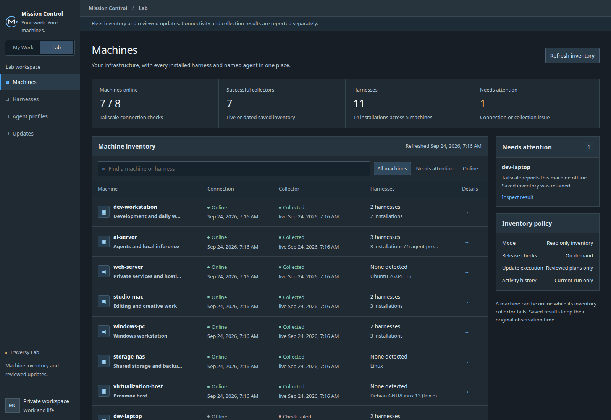

I am rebuilding Mission Control as a private application, and the new Lab
workspace now has real machine inventory behind it. This is still in
development, not a public release.

*Development build with machine names anonymized. Offline machines retain
their last saved inventory.*

I wanted one place to see my machines, the AI tools installed on them, and
which versions need attention. The interface separates that infrastructure
view from everyday work, with machine inspectors, installed tools, agent
profiles, and update checks.

One distinction mattered early: a machine being reachable does not mean its
inventory was collected successfully. If collection fails, the UI keeps the
last successful result with its timestamp. Saved information should look
saved, not like a fresh health check.

The next piece was reviewed updates. Checking for a release is separate from
changing an installation. An update review identifies the machine, installed
version, target version, and method before a run starts. Recent work added
support for Homebrew Codex installations and Hermes runtime updates.

I spent time on the less exciting parts too: visible progress, recovering the
current run after navigation, and making uncertain results clear. Updates
run serially and are not automatically retried when the outcome is unclear.

The Lab has moved beyond the prototype, but implementing an update path does
not prove every installation method works on every machine. That verification
stays specific to the actual tool and host.
